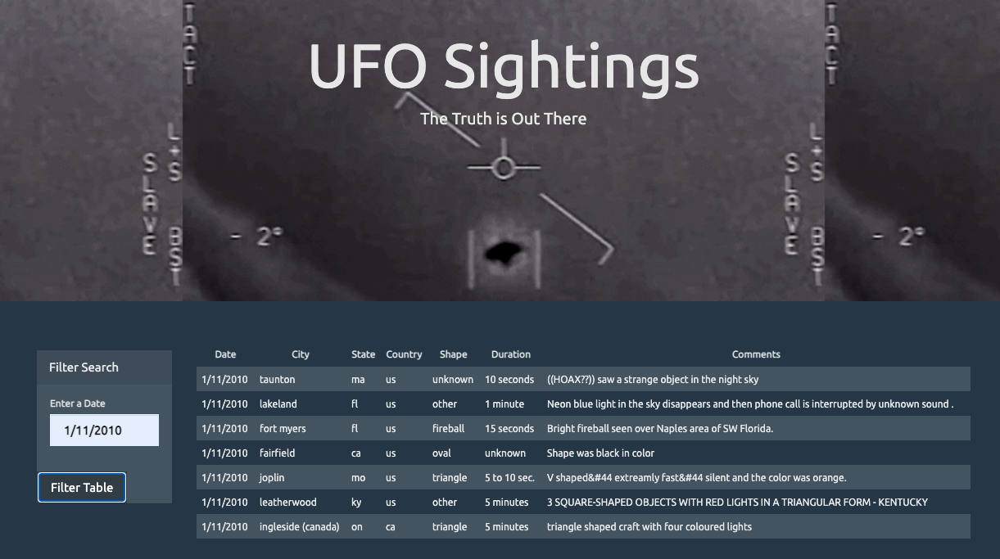
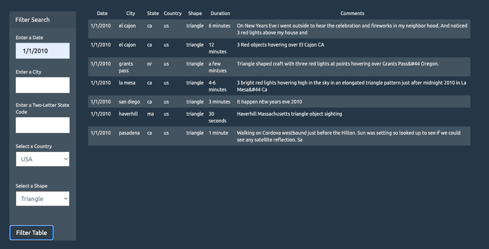

# javascript-challenge
This repository uses JavaScript, HTML, CSS, and D3.js to create a dynamic table that can be filtered to display data that meets specified criteria. The repository has a level 1 and level 2 folder, each containing an html page to display the table, a css style sheet, and a javascript page to handle the table filters. The level 1 folder filters the table based on the datetime field of the data.

The level 2 code, however, is more complex and can handle multiple filters untilizing input fields and dropdown menus. The filters that can be applied in level 2 are datetime, city, state, country, and shape. The javascript code also enables an alert box to pop up if a user inputs a filter that does not match any of the data table, alerting the user that there is no matching data.

Both the level 1 and 2 scripts will default to show all of the data when a user loads the page and when the user leaves the filter input fields blank.

